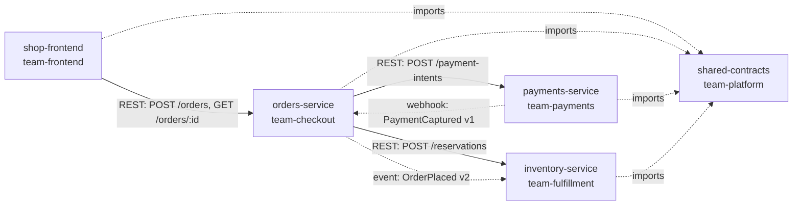

# Architecture overview

Demo-shop is a small e-commerce system split across four runtime components and one shared library, owned by five teams. The coupling is deliberate and documented: every cross-service type and event lives in `@demo-shop/contracts`.

## The order flow

1. The frontend posts a `CreateOrderRequest` (including `channel: 'web'`) to orders-service.
2. Orders-service reserves stock in inventory-service. Reservations expire after 15 minutes.
3. Orders-service creates a payment intent in payments-service and returns the order in `pending_payment`.
4. On capture, payments-service delivers a `PaymentCaptured` webhook to orders-service (3 retries, exponential backoff). Orders-service is idempotent by `eventId`.
5. Orders-service emits `OrderPlaced` v2; inventory-service consumes it and converts the reservation into a stock decrement.
6. The frontend polls `GET /orders/:orderId` every 2 seconds until `paid` or `failed`.

## Change impact rules of thumb

A change to `@demo-shop/contracts` potentially touches every team: check the [event catalog](event-catalog.md) consumer lists before bumping a schema. A change to an API response shape breaks the frontend and any calling service. Event schemas are additive-only; breaking changes require a new version (see shared-contracts ADR 0002).

## Ownership

Every repo carries a `catalog-info.yaml` with its owner, dependencies and provided APIs. That file, not a wiki page, is the source of truth for who owns what.
