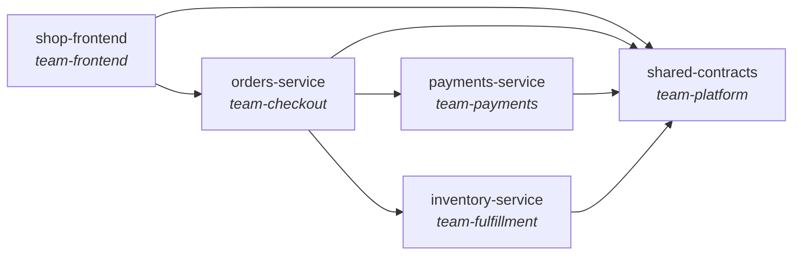

# System catalog

Generated from each repo's catalog-info.yaml. This page, not a wiki, is the source of truth for ownership and coupling.

## Components

| Component | Type | Team | Depends on | Provides | Consumes |
|---|---|---|---|---|---|
| [inventory-service](teams/team-fulfillment/inventory-service/index.md) | service | [team-fulfillment](teams/team-fulfillment/index.md) | [shared-contracts](teams/team-platform/shared-con/index.md) | `inventory-api` | - |
| [orders-service](teams/team-checkout/orders-service/index.md) | service | [team-checkout](teams/team-checkout/index.md) | [payments-service](teams/team-payments/payments-service/index.md), [inventory-service](teams/team-fulfillment/inventory-service/index.md), [shared-contracts](teams/team-platform/shared-con/index.md) | `orders-api` | `payments-api`, `inventory-api` |
| [payments-service](teams/team-payments/payments-service/index.md) | service | [team-payments](teams/team-payments/index.md) | [shared-contracts](teams/team-platform/shared-con/index.md) | `payments-api` | - |
| [shared-contracts](teams/team-platform/shared-con/index.md) | library | [team-platform](teams/team-platform/index.md) | - | - | - |
| [shop-frontend](teams/team-frontend/shop-frontend/index.md) | website | [team-frontend](teams/team-frontend/index.md) | [orders-service](teams/team-checkout/orders-service/index.md), [shared-contracts](teams/team-platform/shared-con/index.md) | - | `orders-api` |

## Dependency graph

[Open the interactive graph](graph.html): pan, zoom, drag, click a service to jump to its docs. Static overview below.

## APIs and their consumers

- `inventory-api`: provided by [inventory-service](teams/team-fulfillment/inventory-service/index.md); consumed by [orders-service](teams/team-checkout/orders-service/index.md)
- `orders-api`: provided by [orders-service](teams/team-checkout/orders-service/index.md); consumed by [shop-frontend](teams/team-frontend/shop-frontend/index.md)
- `payments-api`: provided by [payments-service](teams/team-payments/payments-service/index.md); consumed by [orders-service](teams/team-checkout/orders-service/index.md)
