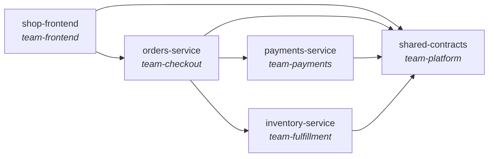

# System catalog

Generated from each repo's `catalog-info.yaml`. This page, not a wiki, is the source of truth for ownership and coupling.

## Components

| Component | Type | Team | Depends on | Provides | Consumes |
|---|---|---|---|---|---|
| [inventory-service](services/inventory-service/index.md) | service | team-fulfillment | [shared-contracts](services/shared-contracts/index.md) | `inventory-api` | - |
| [orders-service](services/orders-service/index.md) | service | team-checkout | [payments-service](services/payments-service/index.md), [inventory-service](services/inventory-service/index.md), [shared-contracts](services/shared-contracts/index.md) | `orders-api` | `payments-api`, `inventory-api` |
| [payments-service](services/payments-service/index.md) | service | team-payments | [shared-contracts](services/shared-contracts/index.md) | `payments-api` | - |
| [shared-contracts](services/shared-contracts/index.md) | library | team-platform | - | - | - |
| [shop-frontend](services/shop-frontend/index.md) | website | team-frontend | [orders-service](services/orders-service/index.md), [shared-contracts](services/shared-contracts/index.md) | - | `orders-api` |

## Dependency graph

## APIs and their consumers

- `inventory-api`: provided by [inventory-service](services/inventory-service/index.md); consumed by [orders-service](services/orders-service/index.md)
- `orders-api`: provided by [orders-service](services/orders-service/index.md); consumed by [shop-frontend](services/shop-frontend/index.md)
- `payments-api`: provided by [payments-service](services/payments-service/index.md); consumed by [orders-service](services/orders-service/index.md)
