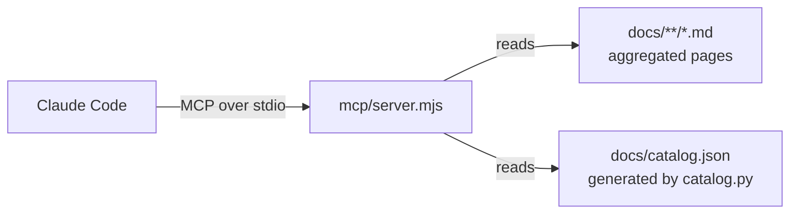

# Docs MCP server

The hub ships an MCP (Model Context Protocol) server that lets AI agents, primarily Claude Code, search these docs and query the component catalog. It is roughly 130 lines of Node with no database: markdown files and one generated JSON are the whole backend.

## How it works



The build pipeline (aggregate → catalog → crosslink → health) produces two things the server reads at query time: the aggregated markdown corpus under `docs/teams/`, and `catalog.json`, a machine-readable dump of every component's owner, dependencies, provided and consumed APIs. Because the server reads the same generated files the website is built from, the site and the AI can never disagree.

## The four tools

### search_docs

Ranked full-text search across every page. Matches in titles and headings score 10x over body mentions, and each hit returns the owning team, the page path and a snippet. Use for "where is X documented".

### get_page

Fetches a page by path. Pass the optional `section` parameter with an H2 heading to get only that section, which keeps agent context small on long reference pages. If the section name misses, the tool returns the list of available sections.

### list_components

Every component with team, type, tags and APIs. The starting point for structural questions ("what services do we have", "what does team-payments own").

### get_component

One component's full record: owner, repo, what it depends on, what depends on it, each provided API with its exact consumers, each consumed API with its providers, and the docs path. This is the impact-analysis tool: "what breaks if payments-service changes its webhook payload" is one call, answered from the catalog rather than prose.

## Setup

1. Install dependencies once: `cd mcp && npm install`
2. Generate the corpus locally (or use a clone of the published state):

    ```
    python scripts/aggregate.py --source .. --github-owner <owner>
    python scripts/catalog.py --source .. --github-owner <owner>
    python scripts/crosslink.py --source ..
    ```

3. Register with Claude Code: `claude mcp add demo-shop-docs -- node <absolute-path>/mcp/server.mjs`
4. Smoke test: ask Claude "use get_component to tell me what depends on payments-service". The answer should name orders-service.

## Troubleshooting

If catalog tools reply `catalog.json not generated`, run `scripts/catalog.py` (step 2 above). If search returns nothing, the aggregation has not run and `docs/teams/` is empty. The server takes the docs directory as its first argument, so a custom checkout location works: `node server.mjs C:\path\to\docs`.

## Semantic search

`semantic_search` finds sections by meaning rather than exact words ("how do we handle money rounding" matches the integer-minor-units ADR). It requires a one-time index: run `scripts/embed.py` with env `VOYAGE_API_KEY` set (also add the key as a repo secret so CI rebuilds the index on publish). Without the key everything else works and the tool politely redirects agents to keyword search.

## Shared HTTP server

The same server runs as a shared team endpoint: `node mcp/server.mjs --http 3333`. Set env `MCP_TOKEN` to require a bearer token. Clients connect with:

```
claude mcp add demo-shop-docs --transport http http://<host>:3333/mcp --header "Authorization: Bearer <token>"
```

`mcp/Dockerfile` packages the server with a baked-in copy of the generated docs, so deploying new docs and deploying the MCP are the same pipeline. A health probe lives at `/mcp/health`.

## Roadmap

Remaining upgrade for the real pilot: replace the static bearer token with OAuth via the company IdP for per-user identity and audit logging, once real internal docs are involved. Network isolation (internal load balancer only) applies in every setup.
