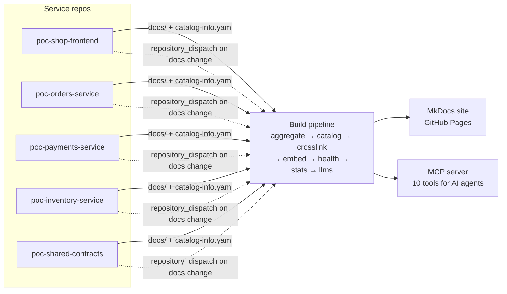

# docs-hub

The documentation platform itself. It owns no business logic: its job is to collect the `docs/` folder of every registered repo, weave them into one searchable site with a system catalog, and expose the same corpus to AI agents through an MCP server. Docs stay in the repo they describe, owned by the team that owns the code; this hub is only ever a build target.

## Architecture

Three inputs, three outputs:

- **Inputs:** each repo's `docs/` folder, its `catalog-info.yaml` (ownership, dependencies, APIs), and the hub's own config (`repos.yaml`, `teams.yaml`).
- **Outputs:** this website, `catalog.json` + `llms.txt` for machines, and the [MCP server](../../../mcp.md) that lets Claude search and reason over everything.

## What runs when

| Trigger | What happens |
|---|---|
| Docs merged in any service repo | `notify-docs-hub.yml` fires a repository_dispatch; the hub rebuilds within minutes |
| Code merged in any service repo | `docs-drift.yml` has Claude compare the diff against the docs and open a docs PR if they drifted |
| Nightly (05:00 UTC) | Full rebuild: catches anything missed, refreshes health and analytics |
| Any push to the hub | Rebuild + [eval suite](reference/pipeline.md) must pass |

## Where things are

- [Pipeline reference](reference/pipeline.md) — every script, in order, with inputs and outputs
- [How to add a repo](how-to/add-a-repo.md) — the 10-minute onboarding
- [How to run locally](how-to/run-locally.md) — full site on your machine
- [ADR-0001](adr/0001-mkdocs-over-backstage.md) — why MkDocs + scripts instead of Backstage
- [Runbook: site build failure](runbooks/site-build-failure.md) — when the pipeline goes red
